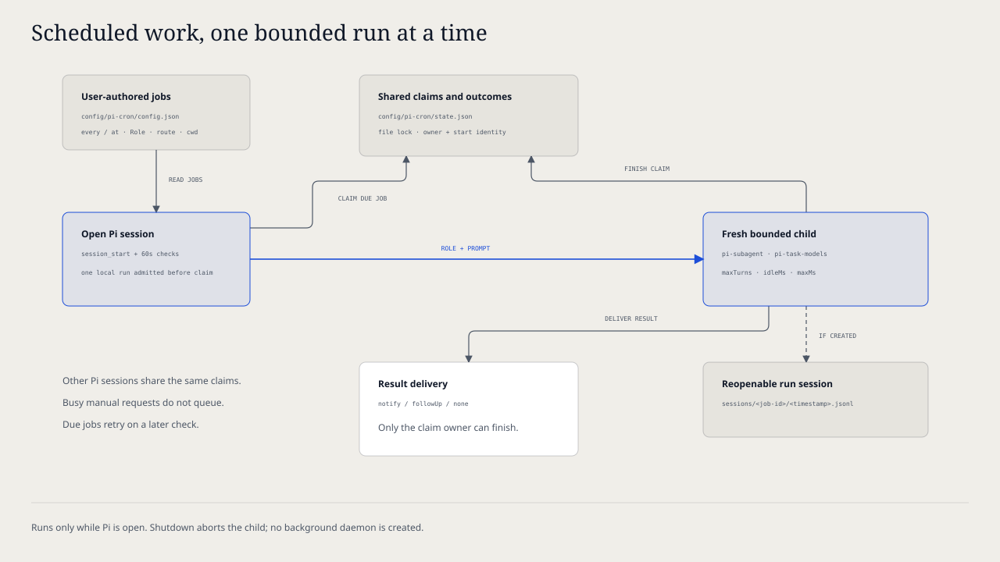

# `@henryqw/pi-cron`

Run a prompt on a schedule in a fresh Pi session, with the Role, model, and thinking level chosen per job. Jobs fire while any Pi session with this extension is open, and created session files can be reopened.

## Install

Requires Pi 1.0.0 or later. Older Pi releases are no longer supported.

```bash
pi install npm:@henryqw/pi-task-models
pi install npm:@henryqw/pi-subagent
pi install npm:@henryqw/pi-cron
```

Run `/task-models` and configure the profiles your jobs use. Create at least one job in the config file below, then run `/cron` to see its next run time.

## Works with

| Package | Relationship | Purpose |
| --- | --- | --- |
| [`@henryqw/pi-subagent`](https://pi.henry.wang/extensions/pi-subagent) | Required | Provides Roles, launch policy, and the bounded child executor that runs each job. |
| [`@henryqw/pi-task-models`](https://pi.henry.wang/extensions/pi-task-models) | Required | Resolves `modelClass` and explicit model routes. |

## Use

Add a job, keep a Pi session open, and the job runs at its next slot. You get a notification with the session file path, or a follow-up message in the current conversation when the job asks for one.

| Surface | Type | Purpose |
| --- | --- | --- |
| `/cron` | command | List jobs with next run and last outcome, then run one now, enable or disable it, or show its last result. Without a TUI it only prints the list. |
| `/cron run <job-id>` | command | Start one job immediately. The result arrives the same way a scheduled run would. |

A job is a Role plus a prompt. The Role decides which tools, extensions, Skills, and MCP servers the run may use, exactly as for `delegate_task`. Any configured Role is allowed, including write-capable ones, because the job entry is authored by you. Keep the prompt's instructions and the Role's tools as narrow as the task needs.

Each run launches a new Pi process in `cwd` with the Role's resources, the job's environment variables on top of the current session environment, and the prompt as its single task. The session is persisted under this extension's home so you can open it later with `pi --session <file>`.

## Flow



1. On session start and every minute after, the extension checks the configured jobs. Before admitting each one, it reloads the config so edits, disablement, and removal made during an earlier run take effect.
2. A job seen for the first time only records a baseline; it first runs at its next slot. Use `/cron run` for an immediate run.
3. A local run slot is admitted before the due job is claimed in shared state, so claims never wait in a child queue. A fresh claim excludes other Pi sessions. A missed slot, for example while no Pi was open, produces one catch-up run, not a backlog.
4. The run is bounded by `limits`: turn count, idle timeout, and maximum runtime. The outcome, a bounded output summary, and the session path (when a file exists) are recorded.
5. Delivery follows the job's `notify`: `notify` shows a one-line notice, `followUp` sends the output into the current conversation and starts a turn, `none` stays quiet. Failures show a notice while a session UI is active. A rejected follow-up does not change the saved run outcome; synchronous delivery errors show a recovery notice.

## Config

Package-owned: `~/.pi/agent/config/pi-cron/config.json`

```json
{
  "jobs": [
    {
      "id": "digest",
      "at": "07:30",
      "timezone": "Asia/Hong_Kong",
      "role": "digest",
      "modelClass": "balanced",
      "cwd": "/Users/me/.config/miniflux",
      "promptFile": "/Users/me/.config/miniflux/digest.md"
    }
  ]
}
```

| Name | Description | Values | Default |
| --- | --- | --- | --- |
| `jobs` | Scheduled jobs. | Array of job objects with unique `id`. | — |
| `jobs[].id` | Job name used in `/cron` and state. | Lowercase letters, digits, and hyphens, up to 64 characters. | — |
| `jobs[].every` | Interval schedule. Exactly one of `every` or `at` is required. | `<n>m`, `<n>h`, or `<n>d` between `1m` and `7d`. | — |
| `jobs[].at` | Daily wall-clock schedule. | `HH:MM` in 24-hour time. | — |
| `jobs[].timezone` | Zone for `at`. Only valid with `at`. | IANA name such as `Asia/Hong_Kong`. | The system time zone. |
| `jobs[].role` | pi-subagent Role to run. | Name of a built-in or user Role. | — |
| `jobs[].modelClass` | Shared task-models profile. Not allowed with `model`. | `fast`, `balanced`, `frontier`, or `fav`. | The Role's `modelClass`, else the `pi-cron/job` task assignment (`fast`). |
| `jobs[].model` | Explicit model. Requires `thinking`. | `provider/model` available in the current session. | — |
| `jobs[].thinking` | Thinking level for `model`. | `off`, `minimal`, `low`, `medium`, `high`, `xhigh`, or `max`. | — |
| `jobs[].cwd` | Working directory of the run. | Absolute path. | — |
| `jobs[].env` | Extra environment variables for the run. | Object of variable name to string. | No extra variables. |
| `jobs[].prompt` | Inline task text. Exactly one of `prompt` or `promptFile` is required. | Non-empty text. | — |
| `jobs[].promptFile` | File whose contents are the task. Read at each run. | Absolute path to a UTF-8 file up to 256 KiB. | — |
| `jobs[].enabled` | Whether the scheduler considers the job. | `true` or `false`. | `true` |
| `jobs[].notify` | How a result reaches you. | `notify`, `followUp`, or `none`. | `notify` |
| `limits.maxTurns` | Provider-turn limit per run. | Safe integer ≥ 1. | `50` |
| `limits.idleMinutes` | Minutes without child activity before the run is stopped. | Positive number; converted milliseconds must be ≤ 2,147,483,647. | `10` |
| `limits.maxMinutes` | Hard runtime cap per run. | Greater than `idleMinutes`; converted milliseconds must be ≤ 2,147,483,647. | `30` |

Only you edit this file, except that `/cron` toggles a job's `enabled` flag after you choose Enable or Disable. Changes apply before the next scheduled admission without restarting Pi; newly added jobs wait until the next check. An already running job keeps its admitted definition and limits. Unknown keys, a job with both or neither schedule, an unknown time zone, a relative path, or an invalid route block all jobs with one error notice until the file is fixed; the file is never rewritten to recover.

Keep secrets out of this file. The run inherits the current session's environment, so point `env` at a private file or export the variable in the shell that starts Pi.

## State and storage

`~/.pi/agent/config/pi-cron/state.json` records each job's first sighting, last start, last outcome, a bounded output summary, the last session path, and any active run claim. Deleting it resets baselines, so every job waits for its next slot again. Invalid version 1 state, including malformed job records or run claims, is reported and left untouched. State writes above 1 MiB fail before replacing the existing readable file; remove inactive job records from `state.json` while Pi is closed to make room. Completion updates require the same claim owner and start time, so a stale run cannot overwrite its replacement's claim or outcome.

`~/.pi/agent/config/pi-cron/sessions/<job-id>/<timestamp>.jsonl` holds each run's Pi session. These files contain the prompt and the model's output; delete them when you no longer need them.

## Limits and recovery

Jobs run only while a Pi session with this extension is open; there is no background daemon. A slot missed while Pi was closed runs once at the next check.

A run cannot answer approval prompts or questions, so a Role that needs interactive confirmation will stall until the idle timeout. A failed or timed-out run records `failure` with the error text. Open the session file when one was created; pre-launch failures have no session and `/cron` says `Session: none created`. Use `/cron run <job-id>` to retry.

Each claim stores its expiration at admission: the original `limits.maxMinutes` plus five minutes after its start. It may be reclaimed only when that deadline is reached; lowering limits does not expire an active claim early. Runs are launched one at a time per Pi session. `/cron run` reports busy instead of queueing when another local job is active; due scheduled jobs are reconsidered on a later check. Shutdown aborts pending preparation and the active child, even if another Pi session starts in the same process. Results are still recorded, but are not delivered into a shutting-down session. Use `/cron` → Show last run to recover a result that could not be delivered.
