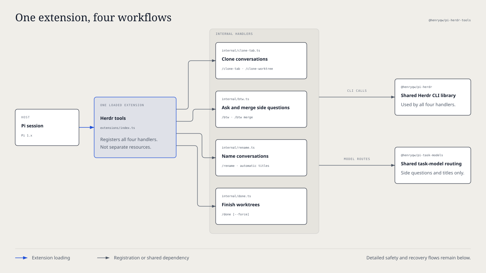
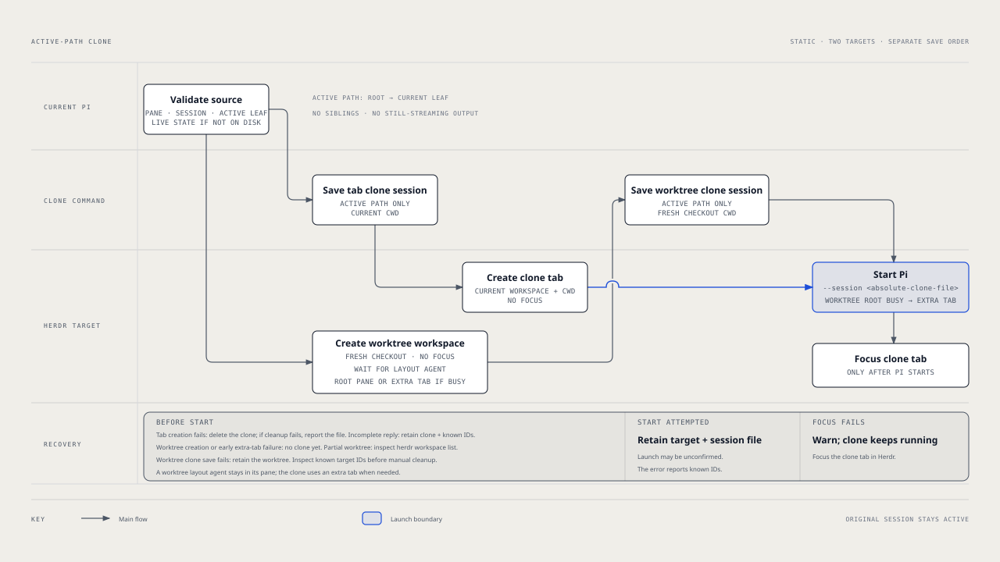
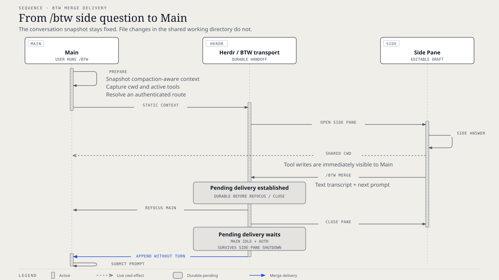

# `@henryqw/pi-herdr-tools`

Clone a conversation into a Herdr tab or worktree, ask a side question and merge its answer back, name the conversation, and finish the worktree safely. One package and one extension entry point provide `/clone-tab`, `/clone-worktree`, `/btw`, `/rename`, and `/done`.



## Install

```sh
pi install npm:@henryqw/pi-task-models
pi install npm:@henryqw/pi-herdr-tools
```

Requires Herdr 0.7.4+. Herdr operations require a Herdr-managed Pi pane; outside Herdr, rename still sets the Pi session title. Run `/task-models`, configure `fast`, and verify it no longer says `not configured` before using title generation or side threads.

### Migrating from the merged packages

`@henryqw/pi-herdr-btw`, `@henryqw/pi-herdr-clone`, and `@henryqw/pi-herdr-rename` are retired. `pi-herdr-clone` previously absorbed `pi-herdr-done`; that package is retired too. Install the replacement first, then remove any old installs before restarting Pi:

```sh
pi install npm:@henryqw/pi-herdr-tools
pi remove npm:@henryqw/pi-herdr-btw
pi remove npm:@henryqw/pi-herdr-clone
pi remove npm:@henryqw/pi-herdr-rename
# Only if the older standalone completion package is still installed:
pi remove npm:@henryqw/pi-herdr-done
```

Only remove sources you have installed. For project-local installs, use `--local` on each command. Remove manually configured old entry-point paths as well; loading an old package alongside this one duplicates commands. The harness installer removes retired personal npm sources only after the selected replacement installs successfully.

No data migration is needed. Commands and safety behavior are unchanged. Existing `pi-herdr-btw/btw` and `pi-herdr-rename/rename` task-model assignments, `pi-herdr-rename/title` session entries, BTW payload flags, and pending deliveries keep their identifiers. BTW configuration remains at `~/.pi/agent/config/pi-herdr-btw/config.json` despite the new package name. Individual features are internal modules, not separately selectable extension resources.

## Works with

| Package | Relationship | Purpose |
| --- | --- | --- |
| [`@henryqw/pi-memory`](https://pi.henry.wang/extensions/pi-memory) | Improves | Recognizes side-thread children and suppresses parent-only memory injection and dream advice. |
| [`@henryqw/pi-task-models`](https://pi.henry.wang/extensions/pi-task-models) | Required | Shared profiles for title generation and side-thread routes. |

The shared [`@henryqw/pi-herdr`](https://pi.henry.wang/packages/pi-herdr) CLI library remains separate. Side questions are inspired by [Claude Code](https://github.com/anthropics/claude-code); this package also merges their transcripts back into Main.

## Use

Run `/clone-tab` to open a new Herdr tab with a clone of the active conversation path; the original session remains open.

| Surface | Type | Purpose |
| --- | --- | --- |
| `/clone-tab` | command | Clone the current conversation into a new tab of the current Herdr workspace. |
| `/clone-worktree` | command | Clone the current conversation into a new Herdr Git worktree workspace. |
| `/done [-f]` | command | Remove the current worktree and close its Herdr workspace tabs; `-f` (alias `--force`) skips confirmation and permits forced removal without checking for tabs in other workspaces. |
| `/btw [<question...>]` | command | For humans in Main: open an empty side pane or start with an editable question draft. |
| `/btw ask <question...>` | command | For humans in Main: ask a question whose first word is `ask`, `config`, `merge`, or `help`. |
| `/btw config [option value]` | command | For humans: show values, set `auto-submit` to `on` or `off`, set `tools` to `inherit`, `all`, `read-only`, or `none`, set `split` to `right` or `down`, or reset defaults. |
| `/btw merge [<prompt...>]` | command | For humans: in a side pane, queue its transcript and next prompt for Main (`/btw merge` opens the prompt editor); in Main, scan for pending side-thread deliveries. |
| `/btw help` | command | For humans: show the command grammar. |
| BTW capability widget | ui | For people in a side pane: shows `tool-free`, `read-only`, or `tool-enabled`. If parent context cannot load, shows the error and recovery steps instead. |
| `/rename` | command | For people: generate a new title from up to five recent user messages. |
| Rename progress and result widgets | ui | For people who run `/rename`: shows `renaming...`, then `renamed to <title>` for two seconds on success. |
| First real user prompt | ui | For people in a new, untitled conversation: starts title generation once the expanded prompt is ready. |
| `pi-herdr-rename/rename` | model task | Title-generation route; users configure its profile through `/task-models`. |

### Clone conversations and finish worktrees

The active path runs from the session root to its current leaf when the command is invoked. Sibling branches and still-streaming assistant output are excluded. Both clone commands require a Pi session in a Herdr pane (`HERDR_ENV=1` and `HERDR_PANE_ID`) and validate the pane, session path, and current leaf before creating a target. If Pi has not written the session file yet, the commands clone the live session state. Neither command has configuration, and the original Pi session is not switched.

Commit or discard changes in a Herdr-managed linked worktree, then run `/done` and confirm. Normal removal refuses dirty worktrees and worktrees in use by another Herdr workspace. **`/done -f` can irreversibly delete uncommitted work and leave other workspaces' tabs pointing at the removed checkout.**

### Ask and merge side questions

From a Herdr-managed Pi pane with a conversation, run `/btw Why is this test failing?` to open a side pane with the question as an editable draft. Submit it there; after the answer, run `/btw merge Apply the smallest safe fix`. Main receives the side transcript, regains focus, and continues with the merge prompt.

### Name conversations

In a new, untitled conversation, send the first real prompt. Pi generates a title in the background without delaying the reply.

## Flow

### Clone conversations and finish worktrees



#### Clone a tab

1. Save the active path as a separate clone session with the current working directory.
2. Create an unfocused Herdr tab in the current workspace with that working directory.
3. Start Pi in the tab's root pane with `--session <absolute-clone-file>`.
4. Focus the new tab after Pi starts successfully.

#### Clone a worktree

1. Create a Git worktree-backed workspace with `herdr worktree create --workspace <current-workspace> --no-focus`. Herdr creates the branch from `HEAD` unless the name exists, checks out the worktree under its configured `worktrees.directory`, and opens it as a grouped workspace. If the current workspace is already a linked worktree, the command targets its repository's parent workspace because Herdr creates worktrees from the parent.
2. Wait briefly for a worktree-layout plugin, such as `herdr-plus`, to start its agent in the new workspace's root pane.
3. If the root pane is occupied, create an additional unfocused tab in the new workspace with the checkout as its working directory. The plugin's agent and the clone then coexist. Otherwise, use the root pane.
4. Copy the active path into a clone session stamped with the fresh checkout path as its working directory.
5. Start Pi in the chosen pane with `--session <absolute-clone-file>`.
6. Focus the clone's tab after Pi starts successfully.

#### Finish a worktree



Normal `/done` asks for confirmation before waiting for Pi to become idle; declining leaves the checkout untouched. `/done -f` skips confirmation. Both wait for Pi to become idle before cleanup.

Normal cleanup checks whether a tab in another Herdr workspace is using the checkout, removes it with `git worktree remove <checkout>`, closes every other tab in the current Herdr workspace, and runs `git pull --ff-only` from the primary checkout when this was a linked worktree and the primary is non-bare. It closes the current tab last. Tabs using the primary checkout do not block removal or the pull. Concurrent completions serialize on locks around the worktree and primary checkout; clone creation shares the worktree lock.

### Side questions

#### Launch

- `ask`, `config`, `merge`, and `help` route only when they are exact first words. Other input is a question.
- A provided question is an editable draft by default.
- `/btw` gives the side pane a static snapshot of Main's compaction-aware context and shares Main's working directory.
- The consumer-owned `pi-herdr-btw/btw` task defaults to `fast`.
- Before pane launch, it selects the first authenticated viable effective profile route.

`~/.pi/agent/config/pi-task-models/config.json` is shared and owned by `@henryqw/pi-task-models`. A task entry is an explicit user override, and routes resolve before pane launch. BTW warns once per session if this file is missing.

#### Merge delivery



- In the side pane, a merge stores the user/assistant transcript and next prompt as pending delivery.
- Herdr then refocuses Main and closes the side pane.
- Pending delivery survives side-pane shutdown. It waits for Main to settle and for current model authentication.
- Main appends the transcript without starting a turn, then submits the prompt.
- Pending delivery remains available until consumed or 24-hour stale cleanup.

### Conversation titles

#### Trigger

In a new, untitled session, the first real user prompt generates a title in the background after Pi expands skill and prompt-template shorthand. It does not delay the main reply. Extension-injected prompts, empty prompts, and image-only input are ignored.

#### Title and branch rules

A semantic branch is a Git-safe branch name made from a task kind and the display-title words. The model replies with one JSON object holding `kind` and `subject`; that classification stays internal. For example, `{"kind":"refactor","subject":"update task logic"}` displays as `Update task logic` and maps to `refactor/update-task-logic`. A reply that does not fit the shape is sent back once with the rejection before the route gives up on it, so a valid title still comes from the first route.

- In a linked worktree, a detached checkout or Herdr `worktree/...` branch is renamed. An existing non-generated branch stays.
- A linked worktree's generated workspace label, such as `worktree-brave-meadow-4aa8`, becomes the display title automatically. A manual `/rename` can also replace a custom workspace name.
- The pane is renamed in Herdr. The enclosing tab updates only when this pane is the tab's only pane.
- Outside Herdr, only the Pi session name changes. Herdr is required for pane, tab, workspace, and linked-worktree branch updates.

#### Model route

The task `pi-herdr-rename/rename` uses `fast` only when it has no explicit assignment. To use another configured profile, assign the task to that profile in `/task-models`; the shared [`pi-task-models` config](https://pi.henry.wang/extensions/pi-task-models#config) stores the assignment under `tasks` at `~/.pi/agent/config/pi-task-models/config.json`.

The extension tries the assigned profile's primary route, then its fallback, while honoring the configured thinking level. Within one route a reply that fails the title shape is retried once with the rejected text; only a second failure moves on to the fallback. It never substitutes the current session model.

## Config

Package-owned: `~/.pi/agent/config/pi-herdr-btw/config.json`

| Name | Description | Values | Default |
| --- | --- | --- | --- |
| `autoSubmit` | Submits the draft question instead of leaving it editable in the side pane. | Boolean. | `false` |
| `tools` | Selects the tools available in the side pane. | `inherit` (parent's active tools), `all`, `read-only` (built-in read-only tools), or `none`. | `inherit` |
| `split` | Sets the side-pane placement. | `right` or `down`. | `right` |

- All fields are optional.
- Unknown keys and non-object files are rejected.
- `/btw config show` prints effective values.
- `/btw config reset` saves the defaults.
- The config file is optional. Missing config uses defaults.
- Malformed config fails visibly and remains unchanged.

## State and storage

### Clones

Each clone is a separate Pi session file in Pi's session directory, containing only the active path. A tab clone uses the current working directory; a worktree clone uses the fresh checkout. Pi's session manager chooses the session directory. For a persisted source session, Pi names the clone file; before the source session has been written to disk, the extension creates and names the clone file in that directory.

### Conversation titles

The Pi session stores each generated display title and semantic branch in a `pi-herdr-rename/title` session entry. When resuming a session created by this version, the extension reapplies the saved title and branch without another model request.

## Limits and recovery

### Cloning

| Outcome | What remains and how to recover |
| --- | --- |
| Definitive target creation failure | A failed `/clone-tab` tab creation removes its clone session when cleanup succeeds; if cleanup also fails, the error names the leftover file. A `/clone-worktree` worktree-creation or pre-launch extra-tab-creation failure happens before a clone session is created. |
| Killed or incomplete worktree creation | Herdr may have retained partial workspace state. The error reports any returned IDs and suggests inspecting `herdr workspace list`. No clone session has been created yet. |
| Incomplete tab-creation response | The error reports known IDs. For `/clone-tab`, the clone session is retained and its path is reported. For `/clone-worktree`, the worktree is retained and no clone session exists yet. Inspect the target before manual cleanup. |
| Agent start attempted | The launch outcome may be unknown. Retain the target tab, panes, and session file; the error reports known IDs for recovery. |
| Focus failed after Pi started | Show a warning, but do not report the already-started clone as failed. Focus the clone tab in Herdr if needed. |

### Worktree completion

- `/done` refuses to remove a dirty worktree. Commit or discard changes first. `/done -f` passes `--force` to Git and can irreversibly delete uncommitted work.
- A tab in another Herdr workspace that uses this checkout blocks normal removal. `/done` lists the tab label, or its ID when no label is available. Close the tab and retry, or use `/done -f` only if you accept removing the checkout while that tab still refers to it. Tabs in other workspaces are not closed.
- The command requires Pi inside Herdr with `HERDR_ENV=1`, `HERDR_WORKSPACE_ID`, and `HERDR_TAB_ID` set.
- The primary checkout update runs only after worktree removal. If `git pull --ff-only` fails, for example because the primary has diverged or has local changes, the worktree is already gone and the current tab still closes. Resolve the primary checkout issue, then retry with `git -C <primary-checkout> pull --ff-only`.

### Side questions

The side pane shares Main's working directory, so enabled tools can change parent-visible files. Choose `read-only` or `none` when the side question should not make changes.

Large parent contexts can exceed child context limits; shorten Main's context and retry.

### Conversation titles

Display titles are natural task phrases, preferably two or three words, and always at most four words and 20 characters. Models that answer in another language still produce English titles.

A missing shared task-model config warns once at session start. Run `/task-models` to configure rename routing. No viable route leaves titles unchanged. `/rename` warns if the session has no user text to rename.

Herdr and Git synchronization failures appear as warnings. Fix the reported issue, then run `/rename` to try again. Cancellation by a newer rename remains silent. Older titles receive no migration.
