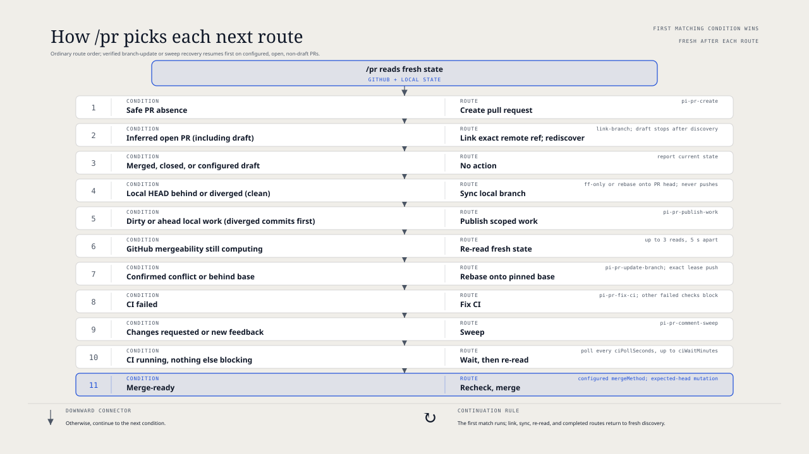

# `@henryqw/pi-pr`

See the current branch pull request in the Pi footer. Run `/pr` to create, update, repair, review, or merge it when safe, without repeatedly checking GitHub by hand.

## Install

```bash
pi install npm:@henryqw/pi-pr
```

Requires an authenticated GitHub CLI session (`gh auth login`) and a GitHub.com or GitHub Enterprise checkout. Verify authentication with `gh auth status`.

## Works with

| Package | Relationship | Purpose |
| --- | --- | --- |
| [`@henryqw/pi-footer`](https://pi.henry.wang/extensions/pi-footer) | Improves | Shows current-branch pull-request status in the shared footer. |
| [`@henryqw/pi-herdr`](https://pi.henry.wang/extensions/pi-herdr) | Required | Provides the Herdr CLI client when workspace renaming is available. |
| [`@henryqw/pi-process`](https://pi.henry.wang/packages/pi-process) | Required | Runs bounded child processes. |

The required packages install with `pi-pr`; Herdr itself is optional.

## Use

Run `/pr` in a GitHub checkout. It reads fresh local and GitHub state, takes the next safe route, and continues until it needs external input, encounters a blocker, waits for CI or review, or merges. It works outside Herdr. A stopped workflow can be retried with `/pr` after the blocker is addressed.

| Surface | Type | Purpose |
| --- | --- | --- |
| `/pr` | command | Human entry point; inspect and act on the current branch's pull request. |
| `pi_pr_create` | tool | Agent-only guarded creation steps selected by `/pr`. |
| `pi_pr_fix_ci` | tool | Agent-only guarded GitHub Actions repair. |
| `pi_pr_publish_work` | tool | Agent-only scoped local work publication. |
| `pi_pr_sweep` | tool | Agent-only feedback triage and publication. |
| `pi_pr_update_branch` | tool | Agent-only conflict rebase and publication. |
| `pi-pr-comment-sweep` | skill | Agent guidance for review feedback. |
| `pi-pr-create` | skill | Agent guidance for creating a pull request. |
| `pi-pr-fix-ci` | skill | Agent guidance for failed GitHub Actions. |
| `pi-pr-publish-work` | skill | Agent guidance for publishing local changes. |
| `pi-pr-update-branch` | skill | Agent guidance for confirmed merge conflicts. |
| Footer | ui | Linked PR number and plain-language status. |
| Widget | ui | Action hint or transient routing status. |

`/pr` accepts no flags, prose, or base argument. Start with the command, not a helper skill or tool: direct calls cannot establish route authority. The helper run is bound to the current session and worktree. Its agent tools use plain-object parameter schemas so providers that omit root-union tools can expose them; action-specific arguments are still checked before the workflow runs.

## Flow



### Routes

| Current condition | `/pr` action |
| --- | --- |
| No PR and a commit ahead or ordinary pending work | Create a PR, provided the destination is unambiguous and safe. |
| One matching published PR without a configured upstream | Link its exact remote ref, then rediscover and continue. |
| Intended uncommitted or ahead local work on an open PR | Inspect and publish only owned paths after validation. Stop if ownership is ambiguous or work cannot be separated. |
| Confirmed merge conflict | Rebase onto the pinned base when local state permits; stop for unclear resolutions. |
| Failed GitHub Actions job | Inspect failure evidence, make a scoped fix, validate, and publish. Other failed checks block without an automatic fix. |
| Changes requested, unresolved threads, or new feedback | Triage and address actionable feedback; leave blocked threads open. |
| Draft, closed, merged, pending review, or running CI | Report the state or wait rather than mutate. |
| Merge-ready | Recheck fresh state and squash-merge. |

Creation chooses the base from `branch.<branch>.gh-merge-base` or the validated `origin` default branch. It requires a commit ahead or ordinary pending work, including untracked files. It stays silent on the base branch itself. The head may be in a fork on the same GitHub host; other fork relationships block creation. A published ref without a PR, multiple candidate remotes or PRs, and unsafe push configuration also block it.

Local work normally takes priority over other open-PR routes, except when `/pr` finds verified, matching-branch recovery for a conflict rebase or feedback sweep; those workflows resume first. Behind or diverged local HEAD blocks publication; a behind base alone never authorizes a rebase. Running CI prevents merging, not a safe earlier route. New or edited standalone comments and review bodies are assessed before merge or waiting; GitHub does not provide a resolution control for these, so they are triaged rather than marked resolved. A sweep makes scoped fixes without a second approval, but new feedback after publication waits for a later `/pr` cycle. Its guarded `commit` action stages only changed owned paths; checks run on the clean committed HEAD before publication. Unrelated changes block the commit, and interrupted commits must be reconciled through `resume` before continuing. A sweep with no edits creates no empty commit. For each addressed review thread, it replies with only the full fixing commit hash; for a non-actionable thread, it replies with a one-sentence rebuttal. It verifies the reply and resolves the thread, even when the fix moved the lines or made the thread outdated. New or edited comment content still blocks resolution.

For an identified PR, the footer shows a linked `PR #number` and a text status such as `N unresolved`, `CI failed`, `merge conflict`, or `merge-ready`. Blocked discovery and unavailable status show generic `PR` text without a number or link. The widget shows a route hint without repeating the footer. Status text remains meaningful without color. When `/pr` begins, the widget shows `⠋ Checking pull request…` until route selection; errors use `✗`, warnings `!`, success `✓`, and neutral routes `●`.

### Refresh and Herdr

Discovery starts in the background when a session starts. Status refreshes after local commits, PR creation, pushes, and completed workflows, but not on a timer; external changes may leave the display stale. `/pr` always reads fresh state before acting. Outside a Git worktree the UI stays silent; discovery failures show `PR · status unavailable` with a generic error. A GitHub API quota error instead reports `GitHub API rate limit exhausted; retry after GitHub resets it` without immediately retrying.

After creating a PR, the extension prefixes the Herdr workspace name with `#<number> • ` when `HERDR_ENV=1` and `HERDR_WORKSPACE_ID` is non-empty. It renames only the workspace, not the branch. Outside Herdr nothing is renamed. A failed rename leaves the PR and UI usable and warns `Herdr workspace rename failed: <error>`.

## State and storage

The Pi session stores the configured PR URL, number, host, head identity, and target identity, but not mutable CI or review state. Discovery revalidates this identity against GitHub; no repository cache is created.

In-progress feedback sweeps keep private recovery under `<agent-dir>/config/pi-pr/sweep/<worktree-id>/state.json`; branch updates use `<agent-dir>/config/pi-pr/update-branch/`. These files protect in-progress decisions and remote mutation attempts. A fresh `/pr` resumes only matching, verified recovery. If you manually committed and pushed a recorded sweep's fixes, `/pr` can recognize that publication when the clean local HEAD equals the live PR head, descends from the original commit, changes only recorded owned paths, and has no uncertain mutation. It preserves the ledger and refreshes feedback before replying or resolving; it does not push again. Other mismatched or malformed records remain unchanged and block routing; do not delete them or replay an uncertain mutation to force continuation.

## Limits and recovery

- `/pr` does not open a browser, run `/done` or `/sweep`, enable auto-merge, or use a merge queue. It only starts workflows when explicitly invoked.
- Pushes use a saved exact remote OID lease and revalidate the destination. Concurrent updates block publication instead of being overwritten. Creation does not change the base branch, and a configured push target does not change upstream settings.
- Direct merge requires a clean, safe local Git state and fresh matching head; it always squashes. GitHub repository policy may still reject it. No branch or worktree is deleted.
- A Git operation in progress blocks direct merge. An unverified conflict rebase needs manual recovery; a verified rebase can resume through `/pr`. Rebasing leaves other local branch refs unchanged, even with `rebase.updateRefs=true`. Branches with merge commits since the fork point require manual rebase resolution.
- Only authenticated GitHub.com and GitHub Enterprise repositories are supported. Resolve ambiguous remotes, unrelated local changes, or GitHub blockers before retrying `/pr`.
